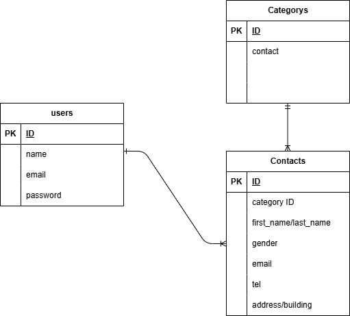

# アプリケーション名
FashionablyLate お問い合わせフォーム

## 環境構築

## Dockerコンテナの起動とビルドとLaravelのセットアップ
1.docker-compose up -d --build
2.cd src
3.composer install
4.cp .env.example .env
5.php artisan key:generate

## マイグレーションとシーディングの実行
php artisan migrate --seed

※ MySQL が起動しない場合は、PC環境に応じて docker-compose.yml を編集してください。

## 使用技術
Laravel 8.x
PHP 8.x
MySQL 8.x
nginx
Docker / Docker Compose
VS Code (開発エディタ)

## ER図

## URL

･ 開発環境： [http://localhost](http://localhost)
･ phpMyAdmin： [http://localhost:8080](http://localhost:8080)

